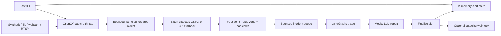

# Smart City RTSP Vision & Agentic Pipeline

A Python 3.10+ demonstration of a low-latency video analytics service: capture frames,
detect people in a restricted zone, triage incidents with LangGraph, and produce
operator reports through a mock or an OpenAI-compatible LLM endpoint.

The default demo needs no GPU, model download, API key, camera, or external service.
It generates a moving green rectangle and detects its pixels as a **simulated person**.
Real video uses OpenCV's bundled CPU HOG person detector or an optional YOLO ONNX model.
Mock detections and reports are explicitly identified in the API.

## Architecture



Capture runs in a background thread. Inference runs off the API event loop. The
frame buffer holds at most `batch_size` frames; the default of one prioritizes
freshness. Batches are opportunistic: the pipeline does not wait to fill them.
The incident queue holds 16 events and drops new events when full. A separate
consumer runs LangGraph, so a slow LLM does not delay capture or detection.

The zone is a normalized `[left, top, right, bottom]` rectangle. A person's bottom
center must lie inside it. Events are limited by a stream-wide cooldown (default
5 seconds). Three or more people in one event trigger urgent operator review;
otherwise the action is notification. LLM text does not change this policy.

## Quick demo (manual)

From the repository directory, create a virtual environment:

```bash
python -m venv .venv
# Linux/macOS
source .venv/bin/activate
# Windows PowerShell instead:
# .\.venv\Scripts\Activate.ps1
python -m pip install -r requirements.txt
python -m src.demo --seconds 10
```

Expected console output includes `Detector backend=mock`, `FRAME ... objects=1`,
`AGENT warning: Restricted-zone incident ...`, and a frame/alert summary. The
rectangle enters the default zone after approximately 1.5 seconds. Counts and
latency vary with machine speed. No video window is required.

For a video or webcam:

```bash
python -m src.demo --source media/sample.mp4 --seconds 30
python -m src.demo --source 0 --seconds 30
```

The CPU HOG detector only emits alerts when it actually detects an upright person
inside the zone; arbitrary video is not guaranteed to produce detections.

## HTTP server

```bash
python -m uvicorn src.main:app --host 127.0.0.1 --port 8000 --workers 1
```

Open [interactive API docs](http://localhost:8000/docs). Execute `POST /start-stream`
with `{}` to start the synthetic demo, then fetch `GET /get-latest-alerts`.

```bash
curl -X POST http://localhost:8000/start-stream -H 'Content-Type: application/json' -d '{"source":"synthetic"}'
curl http://localhost:8000/get-latest-alerts
curl -X POST http://localhost:8000/stop-stream
```

PowerShell equivalents:

```powershell
Invoke-RestMethod http://localhost:8000/start-stream -Method Post -ContentType application/json -Body '{"source":"synthetic"}'
Invoke-RestMethod http://localhost:8000/get-latest-alerts | ConvertTo-Json -Depth 10
Invoke-RestMethod http://localhost:8000/stop-stream -Method Post
```

| Endpoint | Behavior |
| --- | --- |
| `POST /start-stream` | Starts one stream; 409 if already active, 400 on capture failure |
| `POST /stop-stream` | Stops capture/processing; queued reports may still finish |
| `GET /get-latest-alerts?limit=20` | Newest alerts first, limit 1–200 |
| `POST /webhooks/alerts` | Receives a validated Alert JSON; deduplicates by incident ID |
| `GET /health` | Service health, stream state, backend, frame/event counters and error |

Example real-source request:

```json
{
  "source": "media/sample.mp4",
  "backend": "auto",
  "model_path": null,
  "batch_size": 1,
  "fps": 15,
  "loop": true,
  "zone": [0.35, 0.1, 0.8, 0.95],
  "cooldown_seconds": 5
}
```

`source` also accepts webcam index `0` or an `rtsp://...` URL. File paths are local
to the server. Files loop by default; `loop: false` stops at EOF. `fps` paces file
and synthetic playback, independently of the file's original FPS. Live streams
are continuously drained. RTSP open/read operations request five-second FFmpeg
timeouts. A disconnected stream stops with an error in `/health`; restart it
explicitly. Driver buffers and network latency are outside this application's control.

## Docker Compose

```bash
docker compose up --build -d
docker compose logs -f app
```

Then start a stream through `/docs` or the commands above. For a one-command finite
console demo, run `docker compose run --rm app python -m src.demo --seconds 10`.
Stop services with `docker compose down`.

Place video files in `media/` and use `/app/media/sample.mp4` in requests. Model
files go in `models/`. These directories are mounted read-only. For Linux USB
cameras, add `devices: ["/dev/video0:/dev/video0"]` and configure device permissions;
Docker Desktop camera passthrough is platform-dependent, so use a file or RTSP there.
No database or broker is necessary for this bounded, single-process demo.

## Optional YOLO / ONNX / TensorRT path

```bash
python -m pip install -r requirements-onnx.txt
python -m src.demo --source media/sample.mp4 --model models/yolo.onnx --seconds 30
```

Supply your own **YOLOv8/YOLO11 COCO detection export**, float32 RGB NCHW input,
raw output `[B, 84, N]`, **without embedded NMS**. Only person class 0 is retained.
The adapter applies letterboxing, normalization, coordinate restoration and NMS.
Dynamic batches are supported; fixed batches are padded and extra outputs ignored.
Other export layouts (YOLOv5, end-to-end NMS, custom classes, FP16) are unsupported
and cause a logged fallback to CPU HOG. This repository does not download weights.

`backend: "tensorrt"` requests ONNX Runtime TensorRT, then CUDA, then CPU providers
when installed. It is an integration hook, not a bundled TensorRT engine. The
optional `onnxruntime` dependency is CPU-only; GPU providers require a separately
configured compatible runtime. Missing packages, bad weights, or inference errors
fall back to HOG (synthetic startup falls back to mock). The active backend appears
in health and every incident. PyTorch and CUDA are not required.

For Docker, put `INSTALL_ONNX=1` in `.env` and rebuild. Compose reads `.env`
automatically; manual Python launches use exported environment variables instead.

## LLM / vLLM and webhooks

Default `LLM_MODE=mock` generates deterministic reports locally. To use an
OpenAI-compatible Chat Completions endpoint, set:

```text
LLM_MODE=openai
OPENAI_BASE_URL=http://localhost:8001/v1
OPENAI_API_KEY=local
LLM_MODEL=your-served-model-name
```

For OpenAI, use `https://api.openai.com/v1`, your key and a compatible model name.
For a host vLLM server from Docker Desktop use `http://host.docker.internal:8001/v1`.
The client sends **detection metadata only**, not video/images. Qwen-VL-style visual
reasoning is represented by the mock; real VLM image inputs are not implemented.
Timeouts and invalid responses produce `report_source: mock_fallback`.

Set `ALERT_WEBHOOK_URL` to deliver each generated Alert as JSON. Delivery is
best-effort with a five-second timeout and no retries; failures retain the local
alert. `/webhooks/alerts` can receive that same schema, visible in OpenAPI. Receiving
does not trigger outbound delivery, so pointing it at this service does not recurse.

## Tests and operational scope

```bash
python -m pip install -r requirements-dev.txt
python -m pytest -q
```

Tests exercise pixel-based mock detection, API validation, duplicate starts,
end-to-end LangGraph alerts, webhook deduplication, restart, file EOF and fallback.
Real ONNX/GPU models, cameras and external LLMs need separate integration testing.

Use **one Uvicorn worker**: stream state and the last 200 alerts are process-local
and disappear on restart. This is an unauthenticated local demo; Compose binds
only to localhost. API source paths and webhook settings should be controlled by
the operator. Reported latency starts after OpenCV decodes a frame and includes
queue/inference time, not camera-to-server transport or LLM time. There is no
hard real-time guarantee, tracking, persistence, automatic reconnect, or automated
physical enforcement. Slow camera drivers may outlive the bounded shutdown join.

GStreamer template (requires a custom OpenCV build with GStreamer support; the
default pip wheel generally lacks it): use `gstreamer: true` and a pipeline such as
`videotestsrc is-live=true ! videoconvert ! video/x-raw,format=BGR ! appsink drop=true max-buffers=1 sync=false`
as `source`. RTSP pipelines can similarly use `rtspsrc ... ! ... ! appsink`.

## Reference APIs

- [LangGraph StateGraph](https://reference.langchain.com/python/langgraph/graph/state/StateGraph)
- [ONNX Runtime Python API and execution providers](https://onnxruntime.ai/docs/api/python/api_summary.html)

## Layout

```text
src/stream_reader.py  Capture thread and synthetic frames
src/detector.py       Mock, CPU HOG and YOLO ONNX adapter
src/agent.py          LangGraph incident policy and reports
src/main.py           FastAPI and pipeline lifecycle
src/schemas.py        Validated request/event/alert models
src/demo.py           Finite console demonstration
tests/               Local integration tests
```
