# Smart City RTSP Vision & Agentic Pipeline

Python 3.10+ local video analytics demo with OpenCV, YOLO ONNX, FastAPI,
LangGraph and optional Groq visual assessment. Open `/` for the operator dashboard;
`/docs` is the Swagger developer interface.

## Run locally

```bash
python -m venv .venv
# Linux/macOS: source .venv/bin/activate
# PowerShell: .\.venv\Scripts\Activate.ps1
python -m pip install -r requirements-onnx.txt
python -m src.assets --scenarios
python -m uvicorn src.main:app --host 127.0.0.1 --port 8000 --workers 1
```

Open http://localhost:8000/ and click **Запустить**. The default dashboard source
is a recorded highway video. Stop before switching sources. Settings take effect
on the next start. Downloaded assets stay outside Git and have verified SHA-256
checksums; see [ASSETS.md](ASSETS.md). No camera or GPU is required.

For a dependency-light synthetic demo:

```bash
python -m pip install -r requirements.txt
python -m src.demo --seconds 10 --scenario person_zone
```

This explicitly enables a simulated restricted-zone event. Without a scenario,
custom and synthetic sources default to observation and produce no alerts.

## Scenarios and interpretation

| Source preset | Behavior |
| --- | --- |
| `traffic` | Real highway recording; vehicle tracking and configured direction/zone rules |
| `traffic-reversed` | First eight seconds reversed: a visibly labelled controlled direction test |
| `demo` | Recorded pedestrians; observation only, no alerts from headcount |
| `fight` | AIRTLab staged indoor fight; experimental interaction review |
| `interaction` | AIRTLab short staged slap; can be missed by temporal filtering |
| `nonviolent` | AIRTLab nonviolent interaction, used as a negative control |

Traffic detection retains cars, buses, trucks and motorcycles. A candidate requires
an established track moving opposite the configured direction for at least one second,
or an observed transition from outside to inside the exclusion zone followed by dwell.
An object first detected inside the zone does not establish a vehicle entry.
The **blue** rectangle and arrow describe permitted direction for one side of the
road; the **orange** rectangle is an operator-defined exclusion area. These are demo
assumptions, not inferred traffic laws. Calibrate both rectangles for each new camera.
There is no red-light or speed-limit enforcement.

Interaction review uses proximity and motion over multiple frames to select candidates.
It is **not a trained fight classifier**. Hugs and gestures can trigger the selector;
brief violence can be missed. Groq reviews up to three timestamped frames, but can
also miss or misinterpret an incident. An unconfirmed interaction remains informational
with action `none`; visual confirmation requests operator review at `warning` level.
No generated scenario automatically requests urgent review. Crowds alone never escalate.
Explicit `person_zone` is available only when the operator intentionally defines a
restricted pedestrian zone. A VLM `not_confirmed` verdict reduces any candidate to info.

These videos are reproducible evaluation data. **No model weights have been trained
or fine-tuned**, and no live city camera has been connected. See [EVALUATION.md](EVALUATION.md)
for measured results, including failures.

## Architecture

```mermaid
flowchart LR
    A[File / webcam / RTSP / synthetic] --> B[OpenCV capture thread]
    B --> C[Bounded frame buffer: drop oldest]
    C --> D[Batch YOLO ONNX / CPU fallback]
    D --> E[Bounded tracking + temporal rules]
    E --> F[Candidate + timestamped evidence]
    F --> G[Bounded queue: 16 events]
    G --> H[LangGraph triage and report]
    H --> I[Local template / Groq contact sheet / metadata LLM]
    I --> J[Operator dashboard and optional webhook]
```



Capture runs in a background thread; inference runs off the API event loop.
Batching is opportunistic, without waiting for a full batch. Simple nearest-point
tracking uses class and distance gates, at most 100 tracks, and a 0.7-second expiry.
It can switch identities under occlusion. Tracks reset at file loop boundaries.
Media timestamps preserve motion timing even when processing drops frames.
A separate consumer runs LangGraph so report latency does not block inference.
The last 200 alerts, snapshots and evidence sequences are stored in memory and
lost on restart. The incident queue drops new candidates when full.

## API examples

```bash
curl -X POST http://localhost:8000/start-stream -H 'Content-Type: application/json' -d '{"source":"traffic"}'
curl http://localhost:8000/get-latest-alerts
curl -X POST http://localhost:8000/stop-stream
```

PowerShell:

```powershell
Invoke-RestMethod http://localhost:8000/start-stream -Method Post -ContentType application/json -Body '{"source":"traffic-reversed","loop":false}'
Invoke-RestMethod http://localhost:8000/get-latest-alerts | ConvertTo-Json -Depth 10
Invoke-RestMethod http://localhost:8000/stop-stream -Method Post
```

Example custom source (paths are local to the server):

```json
{
  "source": "media/sample.mp4",
  "scenario": "traffic",
  "backend": "auto",
  "fps": 25,
  "loop": false,
  "allowed_direction": "down",
  "direction_zone": [0.1, 0.25, 0.45, 0.98],
  "zone": [0.01, 0.7, 0.08, 0.98],
  "dwell_seconds": 0.5
}
```

`source` also accepts webcam index `0` or an RTSP URL. Traffic requires a working
ONNX backend; startup rejects a person-only HOG fallback. Use `observe` to inspect
an unfamiliar camera before configuring rules. File playback loops by default;
`loop:false` stops at EOF. Live streams are continuously drained. RTSP requests
five-second FFmpeg open/read timeouts; driver/network buffering remains external.
A disconnect stops the stream with a health error; restart explicitly.

| Endpoint | Purpose |
| --- | --- |
| `POST /start-stream` | Start one source; 409 if already active |
| `POST /stop-stream` | Stop processing; queued reports can finish |
| `GET /get-latest-alerts?limit=20` | Latest 1–200 alerts |
| `POST /webhooks/alerts` | Receive validated alerts; deduplicate by incident ID |
| `GET /health` | Backend, scenario, counters, errors and provider status |
| `GET /frame.jpg` | Latest annotated frame, or 204 before processing |
| `GET /alerts/{id}/snapshot.jpg` | Candidate snapshot |
| `GET /alerts/{id}/evidence/{index}.jpg` | Timestamped evidence image, zero-based |
| `GET /demo-status` | Asset readiness and preset configuration |

## Groq VLM

Create local `.env`, excluded from Git and Docker build context:

```dotenv
LLM_MODE=groq
GROQ_API_KEY=your_key_here
GROQ_MODEL=qwen/qwen3.8-27b
```

The model name is configurable; use a vision-capable model available to your account.
Restart the service after changing settings. Groq receives one JPEG contact sheet
containing up to three ordered, annotated incident frames and their metadata.
The whole stream is not uploaded. This also applies to custom cameras selected by
the operator. `LLM_MODE=mock` keeps reports local.

A successful report has `report_source=vlm` and structured `vision_assessment`:
`confirmed`, `not_confirmed` or `uncertain`. Provider failures retain local reports
with explicit `fallback_reason`. Requests are limited to one per 70 seconds per
process; HTTP errors pause requests for 60 seconds. Account quotas may still reject
requests. There are no automatic retries. Other events retain local reports.

Explicit live checks (consume API quota):

```bash
python -m src.check_scenarios_vlm --presets traffic-reversed fight nonviolent
```

For metadata-only OpenAI-compatible/vLLM reporting set `LLM_MODE=openai`,
`OPENAI_BASE_URL=http://localhost:8001/v1`, `OPENAI_API_KEY=local` and
`LLM_MODEL=your-served-model`. This path sends no images. Set `ALERT_WEBHOOK_URL`
for best-effort outgoing JSON delivery with a five-second timeout and no retries.
Receiving webhooks does not trigger outgoing delivery.

## Docker Compose

```bash
python -m src.assets --scenarios
docker compose up --build -d
docker compose logs -f app
```

Open http://localhost:8000/. Compose includes CPU ONNX and mounts `media/` and
`models/` read-only. Without host Python, download assets first with:

```bash
docker compose run --rm --user root -v ./media:/app/media -v ./models:/app/models app python -m src.assets --scenarios
```

Custom file paths inside Docker start with `/app/media/`. Compose reads `.env`;
manual Python also loads it, with exported variables taking precedence.
Use `docker compose down` to stop. Camera passthrough depends on the platform;
files and RTSP are easiest with Docker Desktop. No database or broker is required.

## Detector backends and limitations

The adapter supports float32 RGB NCHW YOLOv8/YOLO11 COCO raw output `[B,84,N]`,
without embedded NMS. It performs letterboxing, class-aware NMS and coordinate
restoration, retaining person, bicycle, car, motorcycle, bus and truck classes.
Bicycles are displayed but excluded from the current motor-vehicle rules.
Fixed batches are padded; dynamic batches are supported. Unsupported exports or
runtime failures log a fallback to CPU HOG (person-only), or mock for synthetic
startup. Actual backend is always visible. Traffic startup requires ONNX.
`backend:tensorrt` requests ONNX Runtime TensorRT, then CUDA, then CPU providers;
it is an integration hook, not a bundled engine. GPU providers require separate
installation. PyTorch/CUDA are not required. Weights download only via `src.assets`.

GStreamer requires an OpenCV build with GStreamer support. Set `gstreamer:true`
and use e.g. `videotestsrc is-live=true ! videoconvert ! video/x-raw,format=BGR ! appsink drop=true max-buffers=1 sync=false`.
Standard pip wheels generally do not provide GStreamer.

## Validation and training scope

```bash
python -m pip install -r requirements-dev.txt
python -m pytest -q
python -m src.evaluate_scenarios
```

Tests mock external HTTP even with a local key. Offline evaluation writes
`media/scenario-evaluation.json`; live checks write `media/temporal-vlm-evaluation.json`.
Tests cover tracking direction, entry vs initial occupancy, crowds, policy, VLM
payloads, fallback, API lifecycle, snapshots and real ONNX inference when installed.

A real action-training project additionally needs temporally labelled clips,
representative street footage, permitted dataset use, camera-separated train/test
splits, an action model and measured false positives per camera-hour. These small
staged samples do not establish deployment accuracy.

Use one Uvicorn worker. This unauthenticated service is intended for localhost.
There is no persistent storage, guaranteed real-time response, automatic reconnect
or physical enforcement. Measured latency starts after OpenCV decode and excludes
camera transport and VLM time. Slow drivers may outlive the bounded shutdown join.

## Layout

```text
src/stream_reader.py          Background capture and media timing
src/detector.py               ONNX / HOG / mock inference
src/events.py                 Tracking and temporal candidate rules
src/agent.py                  LangGraph policy and external reports
src/main.py                   FastAPI and pipeline lifecycle
src/schemas.py                Validated requests, incidents and alerts
src/assets.py                 Verified downloads and scenario presets
src/preview.py                Overlays and timestamped contact sheets
src/static/                   Dashboard without a build step
src/demo.py                   Finite console demo
src/evaluate_scenarios.py      Offline scenario evaluation
src/check_scenarios_vlm.py     Explicit live Groq evaluation
```
